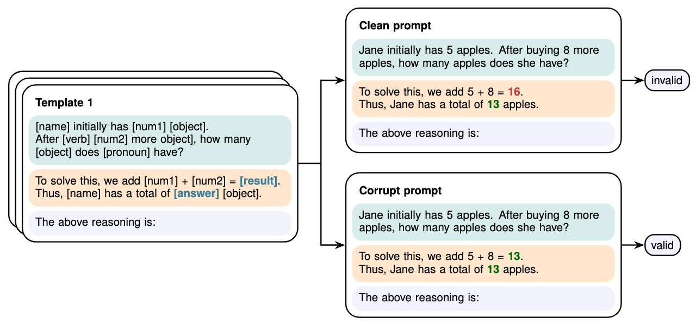

<h1 align="center">The Validation Gap: A Mechanistic Analysis of How Language Models Compute Arithmetic but Fail to Validate It</h1>

<p align="center">
    <a href="LICENSE">  </a>
</p>

This repository contains the code for the paper: Leonardo Bertolazzi, Philipp Mondorf, Barbara Plank and Raffaella Bernardi (2025). [*The Validation Gap: A Mechanistic Analysis of How Language Models Compute Arithmetic but Fail to Validate It*](https://doi.org/10.48550/arXiv.2502.11771).

<div style="text-align: center; width: 100%;">
  <!-- Container to align the image and the caption -->
  <div style="display: inline-block; text-align: left; width: 85%;">
    
    <!-- Caption below the image -->
    <p style="color: gray; font-size: small; margin: 0;">
      <em>The data generation setup.</em>
    </p>
  </div>
</div>

<br>

> **Abstract:** The ability of large language models (LLMs) to validate their output and identify potential errors is crucial for ensuring robustness and reliability. However, current research indicates that LLMs struggle with self-correction, encountering significant challenges in detecting errors. While studies have explored methods to enhance self-correction in LLMs, relatively little attention has been given to understanding the models' internal mechanisms underlying error detection. In this paper, we present a mechanistic analysis of error detection in LLMs, focusing on simple arithmetic problems. Through circuit analysis, we identify the computational subgraphs responsible for detecting arithmetic errors across four smaller-sized LLMs. Our findings reveal that all models heavily rely on *consistency heads*--attention heads that assess surface-level alignment of numerical values in arithmetic solutions. Moreover, we observe that the models' internal arithmetic computation primarily occurs in higher layers, whereas validation takes place in middle layers, before the final arithmetic results are fully encoded. This structural dissociation between arithmetic computation and validation seems to explain why current LLMs struggle to detect even simple arithmetic errors.

## Overview

The repository is organized as follows:

- `llm_error_detection/`: Core library containing all source code for experiments
- `scripts/`: Python scripts for running individual experiments
- `bash_scripts/`: Shell scripts that wrap Python scripts for easier execution
- `data/`: Generated datasets (created during experiments)
- `results/`: Experimental results and outputs (created during experiments)
  - `discovered-circuits/`: Circuit analysis results
  - `attention_analysis/`: Attention pattern analysis results
  - `probing/`: Probing experiment results
  - And other experiment-specific subdirectories

**Important Note:** Most bash scripts require setting the `CACHE_DIR` variable at the beginning of the script. This directory is used for storing downloaded model weights. Example:

```bash
# Set at the beginning of bash scripts
CACHE_DIR="/path/to/your/cache/directory"
```

## Table of Contents
- [Acknowledgements](#acknowledgements)
- [Setup](#setup)
- [Data Generation](#data-generation)
- [Run Experiments](#run-experiments)
- [License](#license)
- [Citation](#citation)

### Acknowledgements

This project uses the [TransformerLens](https://github.com/TransformerLensOrg/TransformerLens) library and an adapted version of the [Auto-Circuit](https://github.com/PMMon/auto-circuit) library.

## Setup
All code was developed and tested on Ubuntu 22.04 with Python 3.11.6.

To run the code, we recommend using Poetry:
```bash
poetry install                          # Install dependencies
poetry shell                            # Activate virtual environment
# Work for a while
deactivate
```

## Data Generation
To generate the mathematical reasoning datasets for different models, use:

```bash
# Run directly through bash
./bash_scripts/data_generation.sh
```

You can modify the following variables in the script to control data generation:

```bash
# Available templates
TEMPLATES=("0" "1" "2" "3" "4" "5" "6" "7")

# Supported models
MODELS=("meta-llama/Llama-3.2-3B-Instruct" 
    "microsoft/Phi-3-mini-4k-instruct" 
    "Qwen/Qwen2.5-1.5B-Instruct" 
    "Qwen/Qwen2.5-Math-1.5B-Instruct")
```

**Note:** This data generation step is necessary for all further experiments.

## Run Experiments

To run the experiments, execute the following scripts in the specified order.

### Circuit Identification
To generate circuits with the respective plots for error detection of mistakes at the level of arithmetic results and numeric answers, and for computation, run:

```bash
# Run directly through bash
./bash_scripts/circuit_discovery.sh
```

The script will identify circuits for each model and template and save them in `results/discovered-circuits/tokenwise/`.
### Evaluate Soft Intersection Circuits

After obtaining individual circuits for each template, you can generate soft intersection circuits and evaluate their faithfulness score for different overlap thresholds by running:

```bash
# Run directly through bash
./bash_scripts/eval_soft_intersection.sh
```

The script will save plots for each soft intersection circuit and their faithfulness scores in `results/discovered-circuits/tokenwise/template_intersection`.

### Model Evaluation
To evaluate the base models on the error detection and computation tasks, run:

```bash
# Run directly through bash
./bash_scripts/baseline_accuracy.sh
```

### Circuits Overlap
To evaluate the IoU (Intersection over Union) and IoM (Intersection over Minimum) of the identified circuits and produce the relative plots, run:

```bash
# Run directly through bash
./bash_scripts/overlap_edges.sh
```

### Visualize Attention Patterns
The attention patterns on prompts with different types of errors can be visualized by running:

```bash
# Run directly through bash
./bash_scripts/interpret_attn.sh
```

### Consistency Head Patching
To replicate the consistency head patching experiment, run the bash script:

```bash
# Run directly through bash
./bash_scripts/intervene_attn.sh
```

### Probing Experiment
To replicate the probing experiment, run the script:

```bash
# Run directly through bash
./bash_scripts/probing.sh
```

### "Bridge" the Validation Gap Experiment
To replicate the "bridge" the validation gap experiment, run:

```bash
# Run directly through bash
./bash_scripts/intervene_residual.sh
```

## License


This work is licensed under a [CC BY-SA 4.0](https://creativecommons.org/licenses/by-sa/4.0/).

## Citation

If you find our work helpful, cite this paper as:
```
@misc{bertolazzi2025validationgapmechanisticanalysis,
      title={The Validation Gap: A Mechanistic Analysis of How Language Models Compute Arithmetic but Fail to Validate It}, 
      author={Leonardo Bertolazzi and Philipp Mondorf and Barbara Plank and Raffaella Bernardi},
      year={2025},
      eprint={2502.11771},
      archivePrefix={arXiv},
      primaryClass={cs.CL},
      url={https://arxiv.org/abs/2502.11771}, 
}
```
